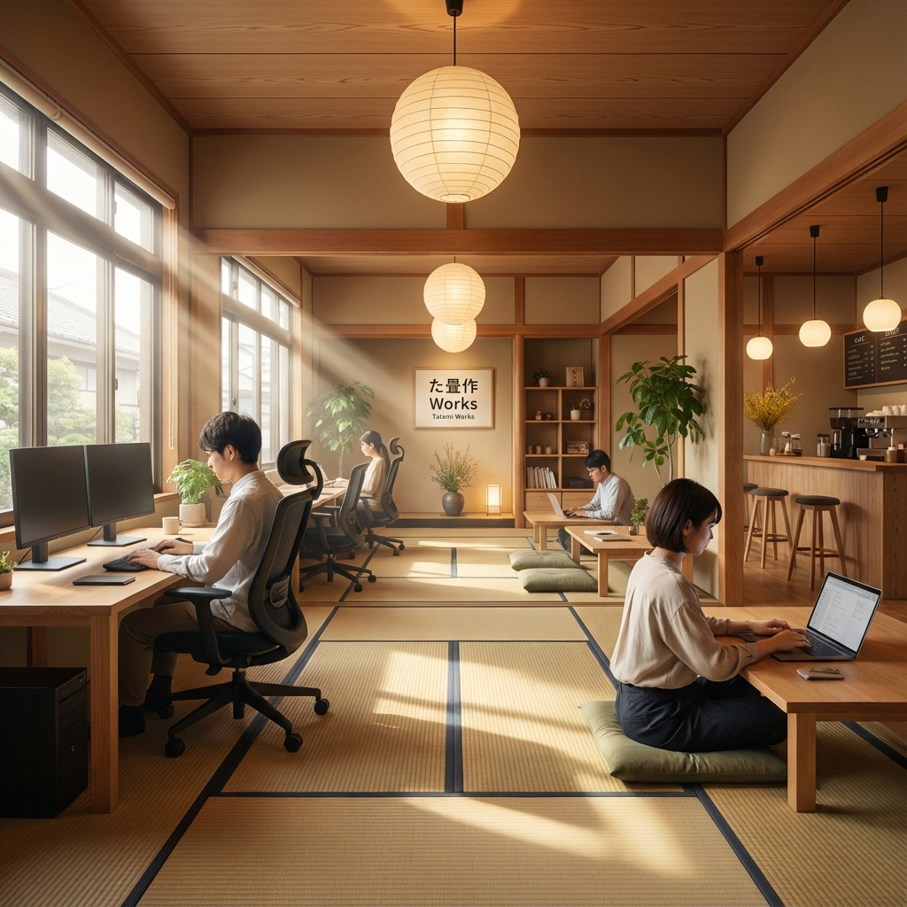
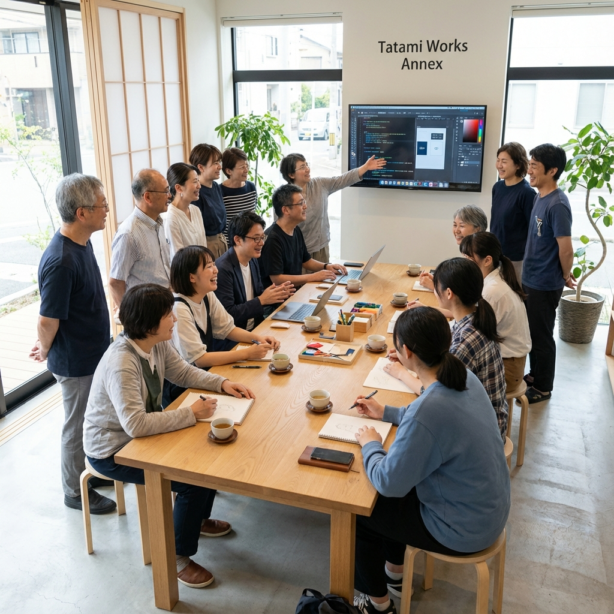

こんにちは!コワーキングスペース「Tatami Works」代表の冨上(とかみ)です🎍

新年あけましておめでとうございます!2026年を迎え、今回は特別編として、2025年の1年間を振り返ってみたいと思います。

この1年、Tatami Worksは大きく成長し、変化し続けてきました。1月のインフラ強化から始まり、4月の24時間営業への移行、そして12月のTatami別館オープンまで、振り返ると本当に濃密な1年だったと実感しています。

それでは、2025年のTatami Worksの歩みを詳しく振り返っていきましょう!

## 目次

1. 2025年のハイライト
2. 四半期別の主要トピック
   - Q1(1-3月): インフラ投資と基盤強化
   - Q2(4-6月): 運営モデルの転換
   - Q3(8-9月): コミュニティ構築
   - Q4(10-12月): 拡張と再編成
3. 主要な変化・転換点
4. 2025年の主要な投資
5. 継続的な課題と2026年への持ち越し
6. 2026年の展望
7. まとめ

## 2025年のハイライト

2025年のTatami Worksを一言で表すなら、「変化と成長の年」でした。

特に感慨深いのは、2024年までは一人もお客さんが来ない日もまあまあありましたが、**2025年は年末年始を含めて誰も来ないという日が一日もありませんでした**。お仕事やお勉強に利用する場所として浸透してきたのかなと思い、とてもうれしく感じています。

売上、お客さんの数ともに増えており、年間を通じて、日々お客さんと接する中で聞こえてきた課題を少しづつではありながら改善し続けることができたと思います。

特に印象的だった変化は以下の2つです:

1. **24時間営業の実現**(4月) - 利用者ニーズの多様化に対応
2. **Tatami別館のオープン**(12月) - プログラミング教室の独立と空間再編

これらの変化を通じて、Tatami Worksは単なる作業場所から、人と人がつながり、新しい価値が生まれるコミュニティスペースへと進化してきました。

## 四半期別の主要トピック

### Q1(1-3月): インフラ投資と基盤強化

2025年のスタートは、設備投資と環境改善に力を入れた期間でした。

1月には、玄関での案内を改善するためにデジタルサイネージを入手し設置しました。初めてのお客様にもパッと見て利用方法が分かるようになりました。また、外観の視認性を上げるためにのぼり旗も設置し、一本先の通りからも見えるようになりました。Tatami Studyではプログラミング検定の合格者を輩出でき、ようやく結果が出て一安心しました。カフェでは初めてカフェ目当てのお客様にも来ていただくことができました☕

2月には、コワーキングスペース利用者限定でコーヒーを100円で提供するサービスを開始しました。これが好評で購入者が増加しました。Tatami Studyでは、プログラミングに加えてBlender・Unityを使った3Dモデリングを学べるデジタルデザインコースを開校しました。また、ナイトプランへの初めての加入者もあり、夜間需要の高さを実感しました。noteの記事を見てご来店いただいたお客様もいて、とても嬉しかったです。

3月には、店舗前に立て看板を設置しました。お店らしさが増し、通行人への認知度が向上しました。作業環境の更なる向上のため、18.5インチのモバイルモニターも追加しました。新生活シーズンということもあり、新規のお客様が増加しました。

この時期は、目に見える設備改善と、それに伴う利用者の増加を実感できた期間でした。特に3月は新生活シーズンということもあり、新規のお客様が増え、「根付いてきた」という実感がありました。

### Q2(4-6月): 運営モデルの転換

4月からは、運営方法の大きな転換期を迎えました。

最も大きな変化は、**24時間営業の開始**です。夜間(19:00〜翌8:00)は会員限定で開放することにしました。プログラミング教室との両立のため、水曜15時以降と土曜8〜18時はドロップイン予約制としました。予約制導入により水曜・土曜の利用者数は減少したものの、その他の曜日では安定した運営を継続できました。大きな変化を伴う施策でしたが、プログラミング教室との兼ね合いを考えると必要な判断だったと思います。また、定期イベントもスタートし、デザイン勉強会、生成AI勉強会、英語勉強会を月曜・木曜の夜に開催し始めました🎉 カフェではグースネックケトルを購入し、クオリティの向上に努めました。

5月には、暑い季節に合わせてアイスコーヒー150円の提供を開始しました☕ この頃から利用者の傾向に変化が見られ、仕事利用に加えて勉強利用が増加してきました。モーニングプランへの新規加入者もあり、早朝からの利用ニーズに対応できるようになりました。24時間営業の効果を実感できるようになり、試験勉強や資格取得など、勉強利用が大幅に増えました。

6月には、ミニ冷蔵庫を設置し、ペットボトルのお茶を100円で販売開始しました。また、コワーキング利用者限定で各種ドリンクを300円で提供するサービスも始めました。月額会員の方々は継続して安定利用してくださり、コミュニティとしての定着を実感しました。一方で、梅雨時期の影響もあってかドロップイン利用は減少し、運営改善の必要性を認識しました。

運営方法の変更に伴う課題も見えてきましたが、それ以上に新しい可能性を感じられた3ヶ月でした。

### Q3(8-9月): コミュニティ構築

夏季は、コミュニティ形成と利用環境の改善に注力しました。

8月には、Tatami Studyで夏期講習を実施しました。3Dモデリング講座や理科実験も開催し、子どもたちが楽しく学ぶ様子が印象的でした。また、日曜午前に**行政書士勉強会**をスタートさせました。公開直後に参加希望の連絡をいただき、とても良いスタートが切れました。1階にエアコンを設置し、昨年までの暑さから解放され、快適な環境になりました。このエアコン効果もあり、例年は落ち込みやすい夏でも利用者数は横ばいを維持できました。日曜日はイベントカフェ形式に挑戦し、勉強会とワンドリンク制を組み合わせたところ好評でした。暑い季節ということもあり、アイスコーヒーの注文が特に多い時期でした。

9月には、スタッフ不在時の課題解決と計画的利用の促進のため、初回利用時の予約制を導入しました。一部劣化した椅子を新しいワークチェアに交換し、リニューアルを行いました。また、利用者の方からモニターを寄付していただき、合計7台のモニターで作業環境がさらに充実しました。継続利用者に支えられ、利用者数は横ばいで安定していましたが、新規利用者がやや減少し、予約制変更の影響を分析する必要がありました。

行政書士勉強会のように、同じ目標を持つ人たちが集まり、学び合い、励まし合う場ができてきたことは、大きな成果だったと思います。

### Q4(10-12月): 拡張と再編成

年末に向けて、Tatami Worksは大きな転換期を迎えました。

10月は、予約制の影響で新規利用者が減少し、課題として認識する月となりました。一方で、既存利用者の方々には安定してご利用いただき、リピーターに支えられる温かいコミュニティができていることを実感しました。この時期、イベント・ワークショップの必要性を改めて認識し、コミュニティ形成の重要性を痛感しました。

11月には、ついに**WiFi高速化を実現**しました!1.4Gbpsへアップグレードし、ルーターも新調しました。10ギガプランにしたことでキャッシュバックの関係で「速くなって安くなる」という一石二鳥の結果となりました。また、日々行っている改善をNotionでカイゼン記録として公開し、誰でも確認できるようにしました。12月のプログラミング教室移転に伴い、ルールの大幅整備を予告し、ミーティングエリアと集中エリアの完全分離を計画しました。

12月は2025年最大の転換点となりました。近くに新しい部屋を借り、**Tatami別館をオープン**しました。プログラミング教室を別館に完全移転し、空き時間は会議室としてコワーキング利用者に貸し出すことにしました。「個室が欲しい」というニーズに応えられる環境が整いました。今後はイベントも別館で開催する予定です。本館では**フロア区分け**を実施し、1階をミーティング・会話可能エリア、2階を集中ゾーンとしました。1階には塾の自習室のようなブース席を設置し、視線を気にせず集中できる半個室を作りました。これにより、席数増加と音の広がり防止を同時に実現できました。

12月の変化は、2025年を締めくくるにふさわしい大きな転換点でした。「集中したいのに周りの話し声が気になる」「打ち合わせをしたいけど周りに気を使ってしまう」という、これまで抱えていた課題を一気に解決する施策となりました。

## 主要な変化・転換点

2025年を通じて、いくつかの重要な転換点がありました。それぞれを詳しく振り返ってみます。

### 1. 24時間営業への移行(4月)

**背景:**
利用者ニーズの多様化が進み、特に夜間や早朝の利用希望が増えてきました。2月にはナイトプランへの初加入もあり、時間帯を問わず利用できる環境の必要性を感じていました。

**実施内容:**
- 19:00〜翌8:00を会員限定で開放
- モーニングプラン、ナイトプラン、フルアクセスプランで対応
- セキュリティ面も考慮しつつ、柔軟な利用を実現

**影響:**
試験勉強や資格取得に向けた学習など、勉強利用が大幅に増加しました。それぞれの目標に向かって頑張る方々の成長の一助になれていると感じています。

### 2. ドロップイン予約システム導入(4月→9月段階的改善)

**背景:**
プログラミング教室との兼ね合いで、特定の時間帯(水曜15時以降、土曜8〜18時)の運営が課題となっていました。また、新規顧客獲得と運営制約のバランスをどう取るかという問題もありました。

**段階的な変更:**
- 4月: 特定時間帯のドロップイン予約制導入
- 9月: 初回利用時の予約制へ拡大

**影響と学び:**
予約制導入により、水曜・土曜の利用者数は減少しました。「予約してまで足を運んでいただく価値のある場所にまだできていない」という厳しい現実も突きつけられました。

一方で、運営側としては来店人数を把握でき、準備や対応がしやすくなるメリットもありました。また、「ふらっと立ち寄れる場所でありたい」という想いと、「明日、集中するために行こう!」と計画して来てくださる方への価値提供、この両立を模索し続けた1年でもありました。

### 3. Tatami別館オープンと空間再編(12月)

**背景:**
プログラミング教室の規模が大きくなり、手狭になってきました。また、「打ち合わせをしっかりできる個室が欲しい」というニーズと、「集中したいのに周りの話し声が気になる」という相反するニーズへの対応が課題でした。

**実施内容:**
- 近くに新しい部屋を借り、Tatami別館としてオープン
- プログラミング教室を別館に完全移転
- 別館の空き時間は会議室として利用可能に
- 本館のフロア区分け: 1階=ミーティング・会話エリア、2階=集中エリア
- 1階にブース席設置で、席数増加と音の広がり防止を両立

**意義:**
この変化により、「集中したい人」「会話したい人」「個室が欲しい人」それぞれのニーズに応えられる体制が整いました。プログラミング教室の独立により、本館はコワーキングスペースとしてより使いやすい環境になりました。

2025年の締めくくりとして、また2026年への橋渡しとして、これ以上ない大きな転換点だったと思います。

## 2025年の主要な投資

**インフラ・設備投資:**
- デジタルサイネージ
- のぼり旗、立て看板
- モバイルモニター(18.5インチ)
- ミニ冷蔵庫
- グースネックケトル
- 茶筅、抹茶碗
- ワークチェア(椅子リニューアル)
- モニター追加(利用者からの寄付含め合計7台に)
- **1階エアコン設置**(夏季の快適性向上)
- **WiFi 10ギガプラン+新ルーター**(1.4Gbps実現)
- ブース席設置
- **Tatami別館契約**(最大の投資)

**IT・業務システム:**
- タブレット(Xiaomi Redmi Pad SE)
- ミラーリングデバイス(デジタルサイネージ用)
- カイゼン記録のNotion整備

**その他消耗品:**
- セイコー置き時計
- TOTOペーパータオルホルダー

年間を通じて、「快適な作業環境」と「コミュニティ形成」の両面に投資を続けてきたことがわかります。

## 継続的な課題と2026年への持ち越し

### カフェ事業の方針転換

年間を通じて様々な施策に取り組んできました。1月に初めてカフェ目当てのお客様が来店し、2月にはコーヒー100円サービスを開始して購入者が増加しました。3月には抹茶ラテをリニューアルして品質向上を図り、5月にはアイスコーヒー150円サービスを開始、6月には各種ドリンク300円サービスやミニ冷蔵庫の設置、8月にはイベントカフェ形式に挑戦するなど、試行錯誤を重ねてきました。

しかし、思うように売り上げが伸びず、**カフェ事業についてはいったん縮小することにしました**。

2026年からは、セルフでホットコーヒーを淹れられるよう設備・システムを改善します。セルフにすることでニーズに応えることができ、お客さんも頼みやすくなると考えています。この方針転換により、運営の負担を減らしつつ、利用者の利便性を高めることを目指します。

### 新規顧客獲得とオペレーションのバランス

**ウォークイン vs 予約制:**
4月の予約制導入、9月の初回利用予約制への拡大を経て、「ふらっと立ち寄れる場所でありたい」という想いと、「計画的に利用する価値のある場所にする」という目標の両立を模索し続けました。

10月には「予約してまで足を運んでいただく価値のある場所にまだできていない」という厳しい現実も突きつけられました。この課題への答えは、2026年も探求し続けることになります。

**季節変動への対応:**
新年や新生活シーズンの需要増、夏季の傾向など、季節パターンも見えてきました。これらを活かした戦略的な運営が、今後の課題です。

### スペース利用の最適化

「会議 vs 集中作業」のニーズ対立は、11月に計画を発表し、12月のフロア区分けで解決の糸口が見えてきました。

- 1階: ミーティング・会話可能エリア + ブース席
- 2階: 集中ゾーン
- 別館: 会議室・イベントスペース

この新体制が実際にどう機能するか、2026年前半が勝負になります。

## 2026年の展望

2025年を振り返ると、「変化を恐れず、改善を続ける」ことの大切さを実感した1年でした。その学びを活かし、2026年はさらに飛躍の年にしたいと考えています。

### 運営の視点の変化

2025年までは、スペースを続けるためにどう売り上げを立てて経費を削減するか、という視点が中心になってしまっていましたが、売り上げ的にも安定してきて、気持ちにも少し余裕ができてきました。

2026年は、**コミュニティとしての充実度、魅力を上げられる一年にしたい**と考えています。

もちろん、お仕事・お勉強をする場所としての機能や設備面での充実も、2025年はかなり進歩したとは思いますが引き続き取り組んでいきます。しかし、それと同時に、コミュニティとしての価値を高めることに、より注力していきたいと思います。

### 2026年の重点課題

**利用者さん同士のつながりを深める:**
課題感として、利用者さん同士のつながりが少ないということが引き続き続いています。2026年はこの点を最優先で改善していきたいと考えています。

そのために重要だと考えているのは:
- **継続的なイベントの開催** - 定期イベントの充実と、利用者企画イベントの支援
- **地域との交流** - 世田谷・千歳船橋の地域コミュニティとのつながり強化
- **SNSなどでの発信** - Tatami Worksの日常や、利用者の活躍を積極的に発信

コミュニティの充実は一朝一夕にはできませんが、2026年はこの基盤をしっかり作る年にしたいと思います。

### 別館の本格活用

**イベントスペースとして:**
これまで本館で行ってきたイベントを別館で開催することで、より自由度の高い企画が可能になります。参加者同士の交流も深まり、真のコミュニティハブとして機能させていきたいと思います。

**会議室需要への対応:**
「打ち合わせをしっかりできる個室が欲しい」というニーズに応えられる環境が整いました。この新サービスをしっかりと周知し、活用していただけるよう努めます。

### コミュニティ主導型への進化

**スタッフ主導からコミュニティ主導へ:**
2025年は「個人的にやりたい!」というスタッフ発のイベントから始まりましたが、徐々に利用者の方々が企画する形へと進化してきました。行政書士勉強会はその好例です。

2026年は、さらに多くの方がイベント企画者として活躍していただける環境を整えたいと思います。

**自律的なコミュニティ形成:**
毎週月曜日の「イベント企画募集の日」を継続しつつ、利用者同士が自然につながり、学び合い、励まし合えるコミュニティへと成熟させていきます。

### インフラとサービスの継続的改善

**WiFi環境:**
11月に実現した1.4Gbpsの高速WiFiを活かし、大容量ファイルのやり取りや、オンライン会議、動画のアップロードなど、より快適な作業環境を提供し続けます。

**利用者フィードバックの活用:**
11月に公開したカイゼン記録を随時更新し、改善の可視化を続けます。「こんな設備があったらいいな」「ここを改善してほしい」というご要望に、これからも真摯に向き合っていきます。

**Notion活用:**
カイゼン記録に加え、イベント情報、利用ルール、FAQなど、情報の一元化と透明性の向上を進めていきます。

### 事業バランスの最適化

**Tatami Study:**
別館での展開により、より専門的で充実したプログラミング・デザイン教育を提供できるようになりました。2026年は、この環境を活かして受講生の成長をさらにサポートしていきます。

**Tatami Cafe:**
2025年の試行錯誤を経て、カフェ事業はいったん縮小し、セルフサービス型へと転換します。セルフでホットコーヒーを淹れられる設備・システムを整備することで、運営の負担を減らしつつ、利用者の利便性を高めます。お客さんが気軽に利用できる環境を目指します。

**Tatami Works(コワーキング):**
フロア区分けによる新体制の効果を検証しつつ、さらなる改善を続けます。「集中したい人」「会話したい人」「個室が欲しい人」、それぞれにとって最適な環境を提供できているか、常に確認していきます。

### 新しいチャレンジ

**運営スタイルの進化:**
予約制の是非、受付時間、イベント開催方法など、2025年に試行錯誤してきたことを、2026年は「Tatami Worksらしいスタイル」として確立していきたいと思います。

**地域とのつながり:**
世田谷・千歳船橋のコミュニティスペースとして、地域の方々にもっと知っていただき、足を運んでいただけるよう、地域連携も強化していきます。

## まとめ

2025年は、Tatami Worksにとって「変化と成長の年」でした。

1月のデジタルサイネージ設置から始まり、2月のコーヒー100円サービス、3月の抹茶ラテリニューアル、4月の24時間営業開始とイベント開催、6月のイベント企画者募集、8月の行政書士勉強会スタートと夏期講習、9月の予約制改善、11月のWiFi高速化、そして12月のTatami別館オープンとフロア区分け──。

振り返ると、本当に濃密な1年でした。

2024年までは一人もお客さんが来ない日もあった状況でしたが、今では多くの方に毎日ご利用いただける場所へと成長しました。これもひとえに、Tatami Worksを信じて足を運んでくださる皆様のおかげです。

2025年を通じて学んだことは、「変化を恐れず、改善を続けることの大切さ」です。24時間営業への移行、予約制の導入、イベントの開催、別館のオープン──どれも大きな決断でしたが、その一つひとつが、Tatami Worksをより良い場所にしてくれました。

時には失敗もありました。予約制導入で利用者が減ったり、カフェ事業が思うように伸びなかったり。でも、そういった失敗から学び、次の改善につなげることができました。

2026年は、2025年に築いた基盤の上に、さらに飛躍の年にしたいと考えています。Tatami別館の本格活用、コミュニティ主導型への進化、事業バランスの最適化、そして新しいチャレンジ──やりたいことは山ほどあります。

Tatami Worksは、単なる作業場所ではなく、人と人がつながり、新しい価値が生まれるコミュニティスペースです。2026年も、皆様にとって居心地の良い場所、仕事や学びが捗る場所であり続けられるよう、改善を続けてまいります。

いつもTatami Worksをご利用いただき、本当にありがとうございます。おかげさまで、2025年は素晴らしい1年になりました。

2026年も、どうぞTatami Worksをよろしくお願いいたします!